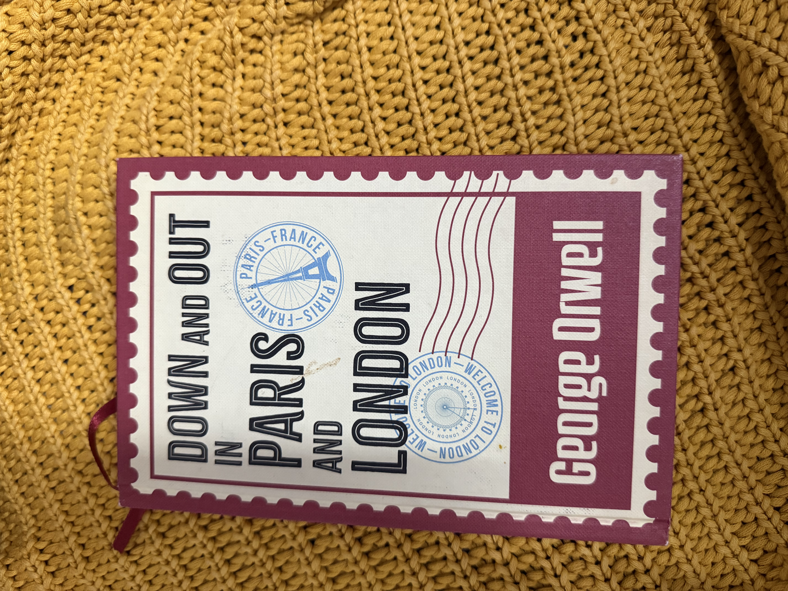

Given the incredibly dry description on the back &mdash; a young writer slumming his way through kitchens and doss-houses in two European capitals &mdash; I wasn't expecting to be this hooked. *Down and Out in Paris and London* was Orwell's first published book, and it is largely autobiographical. His voice in non-fiction is something else; spare, unhurried, faintly amused, and impossible to put down.

## The Paris no one romanticises

I read most of this not long after coming back from Paris myself, and Orwell quietly hijacked the city for me. He doesn't take you to the Paris people put on postcards. He takes you down into the *plonge*'s world: the steaming, roach-ridden hotel kitchens, the seventeen-hour shifts, the wine bought with the last few sous, the pawned coats, the rooms above bistros where the floor sweats. It is a darker tour, and a more honest one. After his Paris, the cafés on the boulevards look a little different.

## A humanising book

What Orwell really does &mdash; and what hits hardest &mdash; is humanise the very poorest of early-twentieth-century London and Paris. The Russian ex-soldiers, the failed waiters, the tramps walking the spike-to-spike circuit of English casual wards: they aren't case studies and they aren't symbols. They are people with jokes, vanities, principles, small kindnesses, and a great deal of pride. He is unsparing about misery but never condescending about the miserable, and I think that is what makes the book stay with you.

Two threads kept catching me:

1. **Work as a trap.** The Paris chapters argue, almost in passing, that a great deal of brutal labour exists not because anyone needs it, but because we are afraid of what the poor would do with free time. Reading that in 2026 is uncomfortable in a useful way.
2. **The geography of being broke.** Orwell maps poverty street by street &mdash; which lodging-house, which soup-kitchen, which bench you can sit on for how long. Poverty in his telling isn't a vague condition; it's a logistics problem you solve every single day until you can't.

## Why it still matters

The book is nearly a century old and somehow none of it feels distant. The cities have changed; the dynamic hasn't. Poverty isn't bound by century, currency, or city &mdash; it is just better hidden now, tucked behind delivery apps and back kitchens and the rooms we don't look into. Orwell's gift is to make you look anyway, without preaching at you for having looked away in the first place.

I loved it. It is also very, very dark &mdash; not in any theatrical sense, but in the matter-of-fact way that the best non-fiction is dark: it tells you the truth and trusts you to sit with it.

> *"It is altogether curious, your first contact with poverty. You have thought so much about poverty &mdash; it is the thing you have feared all your life... and behold! it is merely squalid and boring."*

If you've only read *1984* and *Animal Farm*, start here. This is where the voice was forged.
